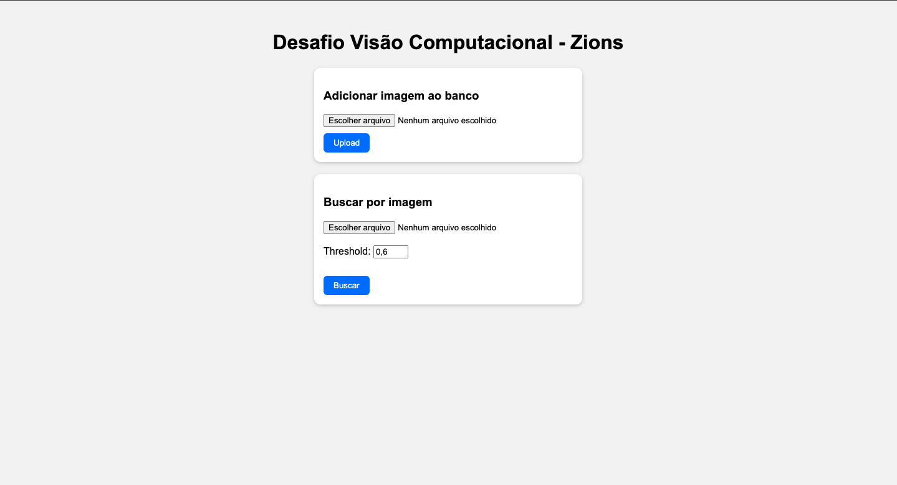

# Desafio Técnico – Visão Computacional (Zions)

Sistema de busca de rostos em uma base de imagens cadastradas, desenvolvido com FastAPI, FaceNet e ChromaDB.
O projeto permite enviar uma imagem, detectar rostos, gerar embeddings faciais e comparar com uma base existente, retornando os rostos mais similares.

## Tecnologias Utilizadas

* FastAPI — Framework backend para criação da API REST
* facenet-pytorch — Rede neural pré-treinada para extração de embeddings faciais
* ChromaDB — Banco de dados vetorial para armazenamento e busca de embeddings
* Frontend (HTML + JS + CSS) — Interface simples para upload e busca de rostos

## Estrutura de Pastas

```
.
├── backend
│   ├── app
│   │   └── main.py              # API principal (FastAPI)
│   └── utils
│       ├── config.py            # Configurações de diretórios
│       ├── database.py          # Operações com ChromaDB
│       └── models.py            # Extração de embeddings (FaceNet + MTCNN)
│
├── db
│   ├── chroma/                  # Banco de dados vetorial (ChromaDB)
│   └── DATASET/                 # Diretório com as imagens cadastradas
│
├── frontend
│   ├── index.html               # Interface do usuário
│   ├── script.js                # Lógica de interação (upload e busca)
│   └── style.css                # Estilos da interface
│
├── requirements.txt             # Dependências do projeto
├── README.md                    # Este arquivo
└── .gitignore

```

## Instalação e Execução

### 1) Clonar repositório
```
git clone https://gitlab.com/zionsvision/es20252s-desafio-rocha/
cd es20252s-desafio-rocha
```

**IMPORTANTE**: Como o dataset original de imagens possui tamanho elevado, as fotos devem ser adicionadas **MANUALMENTE** na pasta **db/DATASET**, pois não foram incluídas no repositório do GitLab devido às restrições de tamanho.

### 2) Criar e ativar ambiente virtual 
```
python -m venv venv
source venv/bin/activate     # Linux/macOS
venv\Scripts\activate        # Windows
```

### 3) Instalar dependências 
```
pip install -r requirements.txt
```

### 4) Executar servidor
```
uvicorn backend.app.main:app --reload
```

O servidor rodará em: http://localhost:8000

## Como funciona

### 1) Extração de Embeddings (backend/utils/models.py)

O sistema utiliza:
* MTCNN — detecção facial.
* InceptionResnetV1 (pré-treinado com VGGFace2) — geração de embeddings.

Somente imagens com rostos válidos geram embeddings.

``` 
from facenet_pytorch import MTCNN, InceptionResnetV1
mtcnn = MTCNN(image_size=160)
resnet = InceptionResnetV1(pretrained='vggface2').eval()
```

### 2) Armazenamento no ChromaDB (backend/utils/database.py)
Cada rosto detectado é convertido em um vetor e armazenado com:
* ID único (UUID)
* Caminho da imagem original
* Vetor de embeddings

Busca por similaridade é feita via Cosine Similarity:

``` 
similarity = np.dot(a, b) / (np.linalg.norm(a) * np.linalg.norm(b))
```

Apenas rostos com similarity > threshold são retornados.

### 3) Endpoints Principais 

| **Método** | **Endpoint**       | **Descrição**                                             |
|-------------|--------------------|------------------------------------------------------------|
| `POST`      | `/search`          | Busca rostos similares a uma imagem enviada                |
| `POST`      | `/upload`          | Adiciona nova imagem ao banco de dados                     |
| `POST`      | `/create-db`       | Gera embeddings para todas as imagens do diretório DATASET |
| `POST`      | `/remove-image`    | Remove imagem e embeddings associados                      |


## Exemplo de Requisição

* Via curl:
```
curl -X POST -F "imagem=@foto.jpg" -F "threshold=0.6" http://localhost:8000/search
```

* Resposta esperada
```
{
  "similar_faces": [
    {
      "id": "a12f3c45-6d7b-890c-123d-456ef7890a12",
      "img_path": "./db/DATASET/pessoa1.jpg",
      "similarity": 0.92
    },
    {
      "id": "b98c765a-4321-00dc-123d-aabbccddeeff",
      "img_path": "./db/DATASET/pessoa2.jpg",
      "similarity": 0.87
    }
  ]
}
```

## Frontend
A interface web (frontend/index.html) permite:
* Upload de imagens novas (/upload)
* Busca de rostos similares (/search)
* Ajuste dinâmico do threshold

 

## Tratamento de Erros 

| **Situação**                | **Status** | **Mensagem**                                           |
|-----------------------------|-------------|--------------------------------------------------------|
| Arquivo não é imagem        | 415         | `"O arquivo enviado não é uma imagem válida."`         |
| Threshold fora do intervalo | 400         | `"Threshold deve estar entre 0.0 e 1.0."`              |
| Nenhum rosto detectado      | 400         | `"Nenhum rosto identificado na imagem enviada."`       |
| Erro interno                | 500         | `"Erro interno no servidor."`                          |

## Extras Implementados

* Endpoint /upload para adicionar imagens
* Endpoint /create-db para criar o banco vetorial
* Endpoint /remove-image para remover rostos
* Frontend completo em HTML/CSS/JS
* Uso de banco vetorial ChromaDB

## Autor
Felipe Rocha Verol <br>
Estudante de Engenharia de Computação – Unicamp <br>
E-mail: felipeverolrocha@gmail.com
